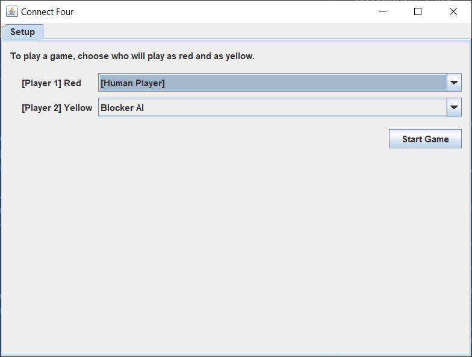
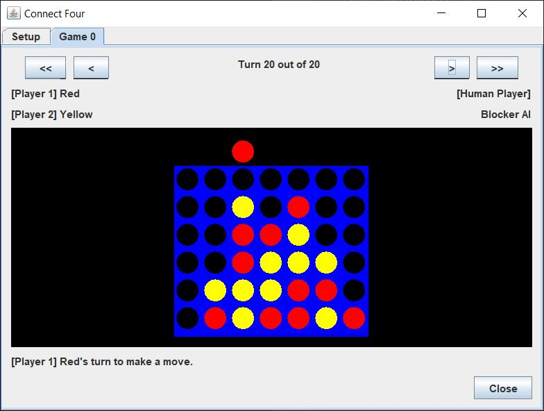
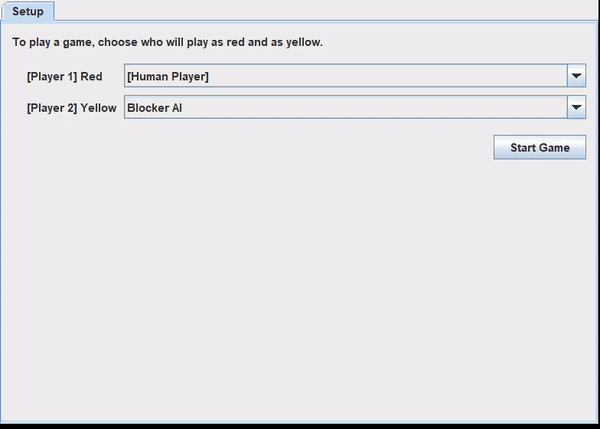
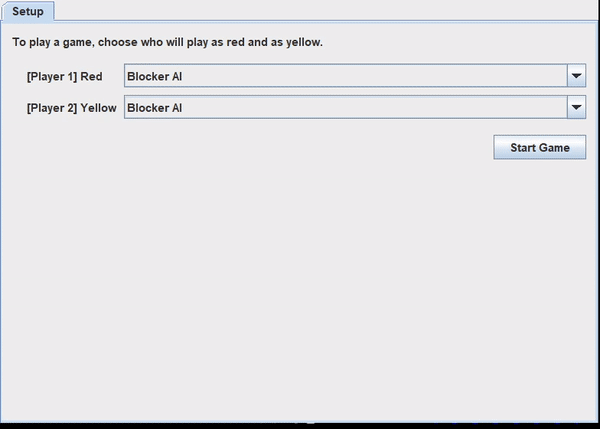
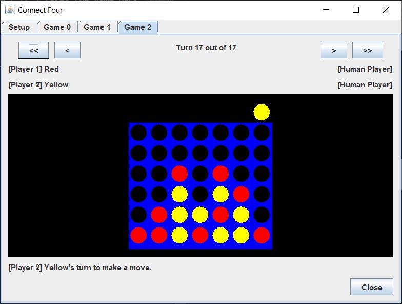

# connect-four

This is a Connect Four gui application written with `javax.swing` that provides a few AIs that the player can play against. Players can start multiple local games where players can play against each other, against a single AI, or have two AIs play against each other. The user can also progress, or reverse, each game they created to undo their moves and see what other moves the AI might do.

## Running the Application

### Requirements

- [Apache Maven](https://maven.apache.org) is used to build and compile the jar file to run the application.
- At the least, the application was programmed with Java SE 11.

### Directions

1. Change directory into the root directory of the project
2. To build the project, run Maven with `mvn clean package`.
   - This will provide a clean slate for the target build files.
   - Then this will start building the project.
   - And run the unit tests.
3. To start the application, run java on the newly created jar file with the command `java -cp ./target/connect-four.jar connectfour.ConnectFourDriver`.

### Usage

The program will open with a gui to a settings panel where the user can select who will be playing as what. The user can play against AIs or another local user, or have AIs play against each other using the dropdown boxes.

The user, when playing against an AI, can use the single step arrows to progress the game by advancing the AI (`>`) or undo the game (`<`) and potentially make a different move.

Furthermore, these controls can be used in a game where both players are AIs. Here, the fast step arrows can be used to auto-complete or go back review the move history of the game. The fast step arrow (`>>`) auto-plays the remainder of the game until completion. The fast undo arrow (`<<`) takes the game back to the initial state.

In addition, multiple games can be played out.

